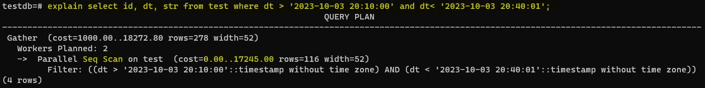
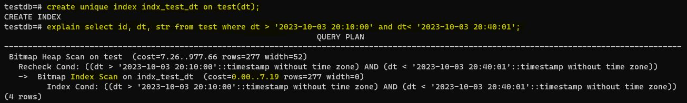

# Домашнее задание №11 (Тема "Виды индексов. Работа с индексами и оптимизация запросов")

Описание/Пошаговая инструкция выполнения домашнего задания:

  > 
  > 

* Создать индекс к какой-либо из таблиц вашей БД
  > 
* Прислать текстом результат команды explain, в которой используется данный индекс
  > 
* Реализовать индекс для полнотекстового поиска
  > 
  > 
* Реализовать индекс на часть таблицы или индекс на поле с функцией
  > 
  > 
  > 
* Создать индекс на несколько полей
  > 
  > 
* Написать комментарии к каждому из индексов
* Описать что и как делали и с какими проблемами столкнулись

  
