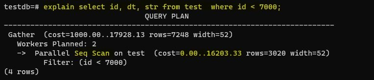
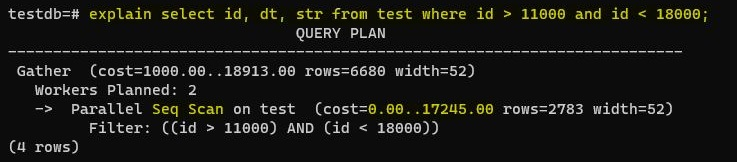

# Домашнее задание №11 (Тема "Виды индексов. Работа с индексами и оптимизация запросов")

Описание/Пошаговая инструкция выполнения домашнего задания:

   __*На виртуальной машине развернул кластер Postgres версии 15. Создал базу данных testdb. В этой базе данных создал таблицу test, наполнил её случайно сгенерированными данными в количестве 1 000 000 записей.*__
  > 
   __*У таблицы test поля: id (порядковый номер записи) - тип integer, dt (случайная дата) - тип timestamp, str (строка) - тип text.*__
  > 
   __*Данные в поле str следующего вида:*__
  > 

* Создать индекс к какой-либо из таблиц вашей БД
   __*Перед тем, как создать индекс к таблице test и заметить как он влияет на чтение данных по индексированному полю, проверю командой EXPLAIN, как происходит чтение данных из таблицы без индексов.*__
  > 
   __*Чтение данных из таблицы может выполняться несколькими способами. Команда EXPLAIN сообщает, что используется Seq Scan — последовательное, блок за блоком, чтение данных таблицы test. Затратность операции: 0.00 — затраты на получение первой строки, второе значение — 17245.00 — затраты на получение всех строк. Rows — приблизительное количество возвращаемых строк при выполнении операции Seq Scan. Это значение возвращает планировщик.*__
  
    __*Теперь создаю уникальный индекс indx_test_dt на поле dt таблицы test.*__
  
* Прислать текстом результат команды explain, в которой используется данный индекс
   __*После создания индекса indx_test_dt выполняю тот же самый запрос с командой EXPLAIN, что и впрошлый раз.*__
  > 
   __*Так как в своем запросе я делаю поиск по полю dt, по которому создан индекс indx_test_dt, то чтение данных уже происходит через Index Scan. Bitmap Index Scan — используется для определения нужных нам записей, а затем PostgreSQL обращается в саму таблицу (Bitmap Heap Scan), чтобы убедиться, что эти записи на самом деле существуют. В моем примере затратность операции стала 7.19, а без индекса было 17245.*__
  
* Реализовать индекс для полнотекстового поиска
   __*Для полнотекстового поиска требуется использовать типы tsvector и tsquery. Первый хранит текст документа в оптимизированном для поиска виде, второй — хранит полнотекстовый запрос. Для поиска в PostgreSQL есть функции to_tsvector, plainto_tsquery, to_tsquery. Как и в прошлый раз перед созданием индекса, проверю как работает полнотекстовый поиск командой EXPLAIN.*__
  > 
  
   __*Чтение данных таблицы test происходит через Seq Scan, затратность операции - 224535.*__
  
   __*Теперь создаю индекс indx_test_str_tsv на текстовое поле str: есть два вида индексов для полнотекстового поиска, GIN - когда выполняется чаще чтение, чем запись в базу данных; и GiST - наоборот, когда выполняется чаще запись в базу данных, чем чтение. Так как у меня тест на чтение, то я использую GIN.*__
  
   __*После создания индекса indx_test_str_tsv на текстовое поле str делаю проверку: запрос к таблице test с поиском по полю str с командой EXPLAIN.*__
  > 
   __*Сделав пару тестов вижу, что применился поиск через Index Scan, затратность операции заметно снизилась, это 141.75 и 204.44 по сравнению с 224535, полученным в прошлый раз.*__
  
* Реализовать индекс на часть таблицы или индекс на поле с функцией
   __*Индекс indx_test_id буду создавать на поле id с условием id < 10000. То есть не на всю таблицу, а на ее часть. Чтобы посмотреть, как будет происходить поиск среди индексированных данных, как изменится затратность операции сперва выполню несколько запросов с командой EXPLAIN, но со значениями ID из разных диапазонов.*__

   __*Случай, когда ID < 7000. Учитывая, что поле ID не индексировано, используется Seq Scan, то есть просматриваются последовательно все записи таблицы test. Затратность операции - 16203.*__
  > 
   __*Далее создаю индекс indx_test_id на поле id с условием id < 10000.*__
   __*Рассматриваю тот же случай, когда ID < 7000, с командой EXPLAIN. Так как в запросе я ищу записи по ID (ID < 7000), которые в том же диапазоне, что и индексированные 10000, то применился Index Scan, затратность операции - 298.13.*__
  > 
    
   __*В следующем примере произвожу поиск по ID (11000 < ID < 18000), которые не входят в проиндексированный диапазон. Тут применился Seq Scan, затратность операции - 17245.*__
  > 
   
   __*В следующем примере я рассматриваю случай, когда производится поиск по ID (ID < 12000), которые частично в проиндексированном диапазоне и частично нет. Тоже применится Seq Scan. Даже если большая часть значений ID искомых данных находится в проиндексированном диапазоне ID. Затратность операции - 16203.*__
  > 

* Создать индекс на несколько полей
   __*Пробую выбрать данные из таблицы test по условиям:  dt > '2023-10-03 10:10:00', dt < '2023-10-03 20:40:01', id < 5000. Поля id, dt пока не индексированы. Смотрю, что показывает планировщик запросов: применился Seq Scan, затратность операции - 18286.*__
  > 
   __*Создаю уникальный индекс indx_test_id_dt на несколько полей, на поля id и dt. Смотрю как отрабатывает этот же запрос планировщик. Затратность операции уменьшилась с 18286 до 182. То есть производительность запроса выросла.*__
  > 

   __*Правильно созданные и используемые индексы могут существенно увеличить производительность базы данных и приложений, работающих с ними.*__
  
* Написать комментарии к каждому из индексов
* Описать что и как делали и с какими проблемами столкнулись

  
